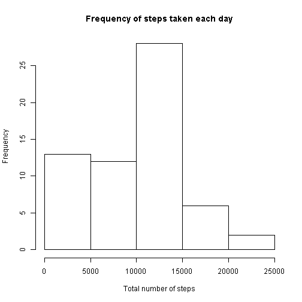
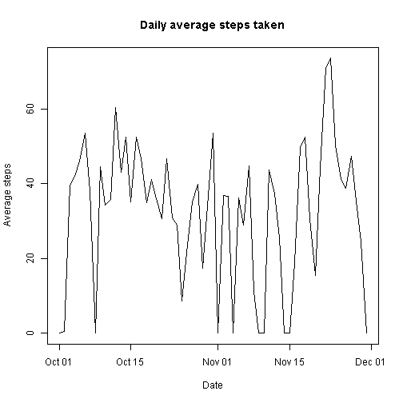
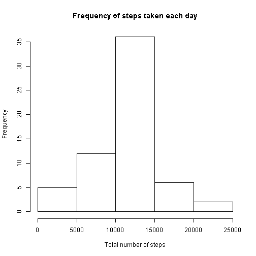
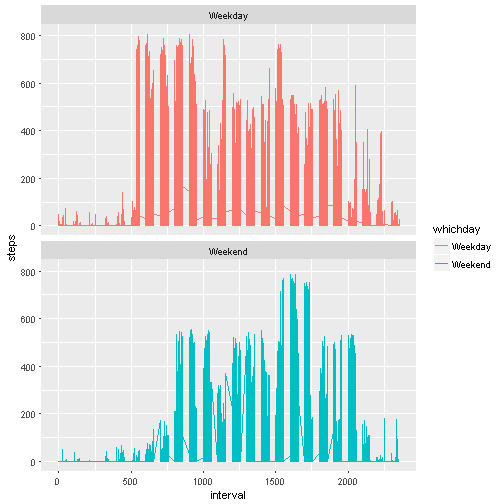

Reproducible research Assignment
==============================================


Load knitr package

```r
if(!require("knitr")){install.packages("knitr")}
library(knitr)
Sys.setlocale("LC_TIME", "English")
```

```
## [1] "English_United States.1252"
```

1. Read in dataset and change date format

```r
df<-read.csv("activity.csv")
df$date<-as.Date(df$date)
```

2. Histogram of the total number of steps taken each day##

```r
##Sum up steps by date
TtlSteps<-tapply(df$steps,df$date,sum,na.rm=TRUE)
hist(TtlSteps,main="Frequency of steps taken each day",xlab="Total number of steps",ylab="Frequency")
```



3. Mean and median number of steps taken each day

```r
meanSteps<-mean(TtlSteps,na.rm=TRUE)
medianSteps<-median(TtlSteps,na.rm=TRUE)
```
The mean and median steps taken each day is 9354.2295082 and 10395


4. Time series plot of the average number of steps taken

```r
avgSteps<-tapply(df$steps,df$date,mean,na.rm=TRUE)
avgSteps[is.nan(avgSteps)]=0
newdf<-data.frame(date=names(avgSteps),avg.steps=avgSteps)
newdf$date<-as.Date(newdf$date)
with(newdf,plot(date,avg.steps,type="l",main="Daily average steps taken",xlab="Date",ylab="Average steps"))
```



5. The 5-minute interval that, on average, contains the maximum number of steps

```r
stepsByinterval<-aggregate(df$steps,by=list(df$interval),mean,na.rm=TRUE)
maxAvgSteps<-max(stepsByinterval[,2])
maxInterval<-stepsByinterval[stepsByinterval[,2]==maxAvgSteps,1]
```
Average of interval with maximum steps : 835


6.Code to describe and show a strategy for imputing missing data

```r
noMissing<-sum(is.na(df$steps))
```
Total missing rows containing values are 2304.

Devise a strategy for filling in all of the missing values in the dataset.

```r
naRows<-which(is.na(df$steps))
df2<-df
avgSteps <- tapply(df2$steps, df2$interval, mean, na.rm=TRUE)
df2$steps[naRows] <- avgSteps[as.character(df2$interval[naRows])]
```

7. Make a new histogram of the total number of steps taken each day

```r
TtlSteps<-tapply(df2$steps,df2$date,sum,na.rm=TRUE)
##New histogram of the total number of steps taken each day after missing values are imputed
hist(TtlSteps,main="Frequency of steps taken each day",xlab="Total number of steps",ylab="Frequency")
```



```r
##New mean and median number of steps taken each day
meanSteps<-mean(TtlSteps,na.rm=TRUE)
medianSteps<-median(TtlSteps,na.rm=TRUE)
```
The new mean and median steps taken each day are 1.0766189 &times; 10<sup>4</sup> and 1.0766189 &times; 10<sup>4</sup> respectively.

8.Panel plot comparing the average number of steps taken per 5-minute interval across weekdays and weekends

```r
df3<-df2
df3$weekday<-weekdays(df3$date)
## To create column identifying weekday or weekend
for(i in 1:length(df3$weekday)){
	if(df3$weekday[i]=="Saturday"|df3$weekday[i]=="Sunday"){df3$whichday[i]="Weekend"
	}
	else{df3$whichday[i]="Weekday"}
}
```
Code to plot graph:

```r
if(!require("ggplot2")){install.packages("ggplot2")}
library(ggplot2)
g<-ggplot(data=df3,aes(x=interval,y=steps,color = whichday)) +geom_line() +facet_wrap(~whichday, ncol = 1, nrow=2)
print(g)
```


